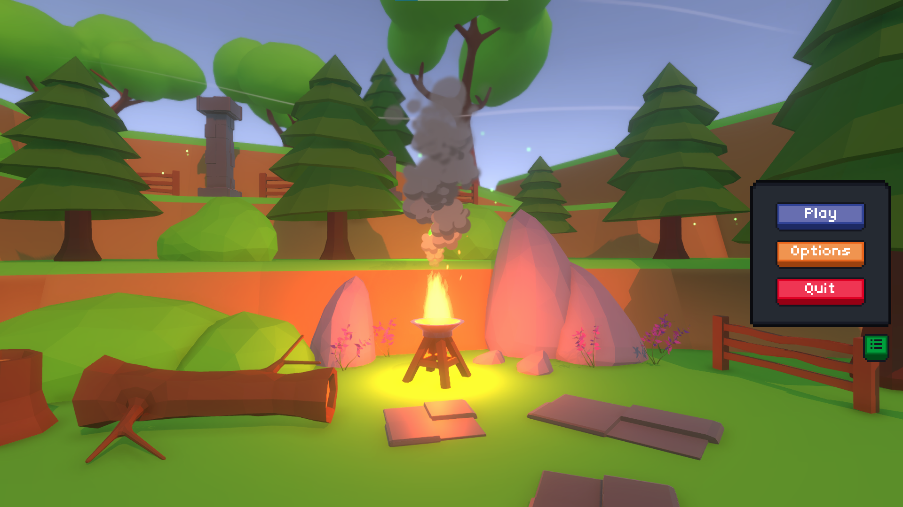

# Project Description
The following project consists of a Unity Rogelike-style game where you have to make it through a forest full of enemies. In each one of the rooms, a randomized number of enemies and items will appear in random positions, so each one of the rooms will never be the same. During the progress of the game, the player will be able to collect gold that can be expended to buy diverse power-ups for the player and finally defeat the final boss of each round.

This repository contains the full C# source code of the game. It does not contain other assets.

 

 

# Technologies

In this case, the project has been developed using the Unity game engine, and the language used in the project has been C#. All the save files of the game have been stored in JSON files, and the enemy stats have been defined inside of XML files.

In the other hand i have been using other tools like GIT for the version control of the project or Blender for all the models of the game.

| Field          | Technology          |
|:---------------|:--------------------|
| Languages      | |
| Game Engine    | |
| 3D Modeling    | |
| Other Tools    |  |

# Architecture

In this project i have felt free to implement some design patterns for optimizing and simplifying the development experience of the game itself and also for learning how to implement some of those patterns.

The patterns implemented are the following ones:

| Pattern               | Use                  |
|:----------------------|:---------------------|
| Observer Pattern      | This pattern has been used for notifying other observers of new changes inside an observable class with the idea of having an automatic data update system, like, for example, in the UI health bar, that is notified each time the user Health System takes damage for updating the health bar value|
| Object Pool           | I have implemented several object pooling systems for controlling in a better way the memory inside the game by limiting the quantity of instances that are generated of each one of the elements and reusing them all the time. These pooling systems have been used for all the projectiles of the game, enemies, particles and also the pickable items|
| State Machine Pattern | This design pattern has been used for managing in a much more controlled way the states of the player and all the enemies in the game. In my case i have been using a Finite State Machine, on top of the Unity animator|

# Resources
In the following section, we can find some of the resources related to this project. If we click on the title of the resource, we will be redirected to the resource itself:

### [Game Design Document](https://docs.google.com/document/d/1yRzMrlOY9arHp1c5qdJEjqAKFTvX-puAGgSh9wGcB34/edit?usp=sharing)
> In the following document, I cover all the implementations of the game and the specification of all the functional
> requirements pertaining to the development cycle of the project.

### [User Guide](https://docs.google.com/document/d/1IpntsQElbP21cBSIBbYM9Lc7lxUPbzYvdrQ6ULHa4RY/edit?usp=sharing)
> This resource contains an explanation of how the game controls and menu work.

### [Video Game Demo Video](https://drive.google.com/file/d/1tTf453SzjdlJIhqOk2Q4_aLY1W-KeK53/view?usp=sharing)
> This video contains an explanation of how the game works, with all the controls and information about the menu's
> difficulty levels...

### [Video Game Installers](https://drive.google.com/drive/folders/1MMLYhYLn6DDuCotGgT0xlMDpjBQ8xfkh?usp=sharing)
> A link to a shared resource inside Google Drive that contains a Windows and Linux build of the game.

### [Promotional Video](https://drive.google.com/file/d/1QrJTo-iL1z9ULgjRQ8w5f1nAjDXubXMU/view?usp=sharing)
> The following link contains a promotional TikTok video that we have to create for the FOL subject.
